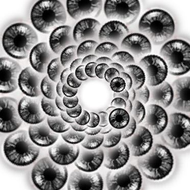

# jinx
A simple, high-level .png and .gif effects utility built on top of [Pillow](https://pillow.readthedocs.io/en/stable/), [Numpy](https://numpy.org/), and [Shapely](https://pypi.org/project/Shapely/). Additionally, jinx provides a simple interface for screen-grabbing continuously into images, and easily converting images into .gif.

Key jinx interfaces:
- `jinx.Sorceress`: load an image, apply some effects, and save the altered image
- `jinx.GifMaker`: turn a folder of images into a .gif
- `jinx.FrameHandler`: keep track of each .png file as a frame... duplicate frames, reverse the order of frames, other frame utilities
- `jinx.ScreenGrabber`: capture a portion of your screen, one image at a time or continuously, and save captured images to a folder

This project intends to bring some fun high-level effects and utilities to Python, not necessarily do anything revolutionary. For more robust image effects/generation tools, check out [Processing](https://processing.org/) and [ImageMagick](https://imagemagick.org/index.php).

:warning: WARNING: some gifs generated with this tool may produce flashing effects.

# Installation
Developed with Python 3.10.1:2cd268a.

Create a virtual environment in the root project directory:
```commandline
python -m venv venv
```

Pip setup and installation:
```commandline
venv/Scripts/python.exe -m pip install --upgrade pip
venv/Scripts/python.exe -m pip install git+https://github.com/jray-afk/image-jinx#egg=jinx
```

Run the following test script to check if the installation worked:
```commandline
venv/Scripts/python.exe test/hello_world.py
```

# Setup
You can optionally set a base output folder at the jinx top level from which all subsequent out folders defined (via the Sorceress,  GifMaker, or ScreenGrabber) will become the child if you don't want to keep repeating the parent folders in output file paths:
```python
jinx.Jinx.set_out_folder('test/out')
```

For example, creating an image Sorceress with the following `out_path` and calling `.save()`:
```python
sorc = jinx.Sorceress(img_path='input_image.png', out_path='my_altered_image.png')
sorc.save()
```

Will read the input image `input_image.png` into the image Sorceress, and output the new image file to `test/out/my_altered_image.png`. Since we haven't done any image manipulation commands with the Sorceress yet, `my_altered_image.png` should be a copy of `input_image.png`. See next section for how to apply effects with the Sorceress.

# Image Sorceress Usage
jinx's main component is the image Sorceress. Example usage:
```python
# define the image sorceress
sorc = jinx.Sorceress(
    img_path='test/assets/jinx-test/logo.png',  # image you want to alter
    out_path='test_cleave/test_cleave.png' # where you want to save the new altered image
)
```

Once the Sorceress is defined, you can call various commands to alter the image:
```python
sorc.static()
sorc.cleave()
sorc.neon()
#...
```

Note that alterations stack unless you call `sorc.reload()` to reload the original image for a clean slate to add an alteration onto. View the `examples` and `test` folders for full example usages.

Here are some reference images we can apply some example effects to (Jinx logo generated with [Brandmark](https://brandmark.io/)). (Note that there is no alpha channel on these .png images; inputting an image with an alpha channel to some effects as of now may produce unexpected results.) View the current state of the image within the Sorceress by calling `sorc.show()`:


Here are examples of effects that can be applied:

| Effect       | Description                                                                                                                                                                                                                                                                                                                                                                                                                                                                                                                                                                                                                       | Sorceress Command     | Example Image                                                                                                                                                       |
|--------------|-----------------------------------------------------------------------------------------------------------------------------------------------------------------------------------------------------------------------------------------------------------------------------------------------------------------------------------------------------------------------------------------------------------------------------------------------------------------------------------------------------------------------------------------------------------------------------------------------------------------------------------|-----------------------|---------------------------------------------------------------------------------------------------------------------------------------------------------------------|
| Static       | Make it static-y! Can apply any colors desired and tweak the amount of static to be added. This example uses white, yellow, and blue.                                                                                                                                                                                                                                                                                                                                                                                                                                                                                             | `sorc.static()`       |                                                                                                              |
| Cleave       | Define a center point and angle for which to cut the image, and define how many pixels you want to shift one of the halves. This example cleaves at the center point of the image in varying angles with each frame. (Frames are animated using `jinx.GifMaker`, see next section.)                                                                                                                                                                                                                                                                                                                                               | `sorc.cleave()`       |                                                                                                                |
| Alpha Border | Define an easing function to control the gradient of the alpha from the border (in this case, `jinx.easings.ease_in_quint` was used).                                                                                                                                                                                                                                                                                                                                                                                                                                                                                             | `sorc.alpha_border()` |                                                                                                    |
| Rose Petal   | Duplicate the image many times, like a petal of a rose, in a circular pattern. Control the number of rings in the rose and the noise at which to place the center of the petals, as well as random rotation of each petal and the rate at which the petals get bigger based on which ring of the circle they're on. Apply alpha border to the reference image as in the effect described above to clean up the image border before pasting the petal. The first image uses default parameters, and the second image suppresses `sorc.reload()` to apply the effect within the effect (see `test/test_rose_petal.py` for example). | `sorc.rose_petal()`   |     |
| Wave         | Define the elements of a wave, such as how many chunks to divide by, what axis to wave along, and what easing to use to define the chunk delta for each frame (default is `jinx.easings.ease_in_out_normal`). Animated with `jinx.GifMaker` (see next section; this is a non-linear animation).                                                                                                                                                                                                                                                                                                                                   | `sorc.wave()`         |                                                                                                                    |
| Broken Glass | Define the number of fractures, the chance that a fracture will break off into another direction, how dramatic the change in direction is, and the max random rotation that a piece can have. Animated with `jinx.GifMaker` (see next section).                                                                                                                                                                                                                                                                                                                                                                                   | `sorc.broken_glass()` |                           |
| Neon         | Add a neon glow effect to edges of the image. Can define whatever colors you want; neon pink, purple, and blue are the defaults. See `src/jinx/colors.py` for list of colors out of the box, or create your own color as an `[R, G, B]` list.                                                                                                                                                                                                                                                                                                                                                                                     | `sorc.neon()`         |                                                                                                                    |


# GifMaker
The following .gif was made using the jinx ScreenGrabber (see ScreenGrabber section) for the [rover-wheel-angle-calculator](https://github.com/jray-afk/rover-wheel-angle-calculator) project.


Using jinx to produce multiple `.png` files, whether through the Sorceress or ScreenGrabber, you can call the GifMaker on the output folder containing all the desired images to produce a .gif of the images. Make sure you only have `.png` files in the folder that you want to include in the .gif; the GifMaker will grab all `.png` files in the folder to include in the .gif.

The GifMaker will grab images in the order of the filename, which is why the FrameHandler (later section) numbers each image produced in ascending order.

Example usage, using [Scott Sterling's famous soccer shootout footage](https://www.youtube.com/watch?v=8F9jXYOH2c0):
```python
# turn output into gif
gm = jinx.GifMaker(
    images_folder='test/out/test_screen_grabber_soccer_shootout',
    out_path='soccer_shootout_simple_linear.gif',
    ms_between_frames=60
)
gm.draw()
```


If you want the animation to appear non-linear between frames, i.e. speeding up or slowing down in some parts, consider trying an easing function like so (see later section for more on easings):

```python
gm = jinx.GifMaker(
    images_folder='test/out/test_screen_grabber_soccer_shootout',
    out_path='soccer_shootout_simple_easing.gif',
    total_duration=1750,  # in milliseconds
    framerate_easing=jinx.easings.ease_in_quart
)
gm.draw()
```


Instead of defining a linear `ms_between_frames` value, give a `total_duration` value representing the total milliseconds of the whole .gif, and define a `framerate_easing`, a function to determine how long each frame should last. (Think of the easing x input as frame number, and easing y output as fraction of frame duration to total .gif duration.) While the frame rate technically is still a constant value, jinx duplicates frames where the .gif should be slower based on the easing function output, giving the illusion of a changing frame rate within the .gif. Note that this means that duplicating frames increases the number of total frames in the resulting .gif. If you are worried about the .gif having too many frames, you can check how many frames the final image has by calling the following:

```python
print(f"Final number of frames in .gif: {gm.n_frames}")
```

The GifMaker will also calculate the final frame rate. You can check the final frame rate (in milliseconds) by calling the following:

```python
print(f"Final ms between frames in .gif: {gm.ms_between_frames}")
```

Additionally, using `gm.frame_handler.duplicate(reverse=True)`, we can duplicate all frames in the gif and reverse the duplicates so that the gif goes forward and then in reverse to complete one full loop like so:


See next section for more on the FrameHandler.

# FrameHandler
The `jinx.FrameHandler` is for handling multiple images from the Sorceress or ScreenGrabber (ScreenGrabber next section). You don't always need to interface with it in order to use `jinx`, its logic runs in the background when you call `.save_frame()` on a Sorceress object, or when `.capture()/.run()` is called from a ScreenGrabber object.

Instantiating a FrameHandler object on the folder, or calling the frame handler on the folder from a Sorceress, you can easily reverse all the frames like so before you call the `GifMaker` on the folder:

```python
# grab frame handler from Sorceress
sorc.frame_handler.reverse_frames()
# or create a FrameHandler object based on out_path
fh = jinx.FrameHandler(
    out_path='test/out/test_frame_handler',
    check_existing=True
)
fh.reverse_frames()
```

The benefit of calling the Sorceress if you already have one is that you don't have to duplicate the `out_path` string. However, if you have a folder of images that you do not need tied to a Sorceress, you can instantiate the FrameHandler object by itself on the `out_path`.

The FrameHandler also has other frame file handling utilities such as `.recalc_indices()` which comes in handy if you delete a file that you want to exclude from the .gif and you don't want to manually rename all the file names so that they jibe with the FrameHandler's frame indexing system. Simply run this function, and the FrameHandler will figure out what the names of the files should be with good indices, and it will rename all the errant file names for you with good indices in the file names.

# Easing Functions
Go to [easings.net](https://easings.net/) to learn more about easings with visual examples. You can create your own custom easing function to pass to various jinx objects, you do not need to necessarily use a `jinx.easings` function.

In general, an easing function is a function which takes an x input from 0 to 1, and gives a y output from 0 to 1, where the relationship between x and y could be any function. This means that we can scale any value from 0 to 1 and plug it into the easing function to convert a linear value (x input) to a possibly non-linear value (y output). This can have interesting applications!

While mostly targeted at animation where x is a time value and y is the position of some moving part, easing functions can be used in other places as well, such as in the petal alpha definition in the `sorc.rose_petal()` effect. The petal alpha (y) increases away from the image center (distance x), and so the easing function you choose decides the rate of alpha change as it goes away from the image center. Here, x=0 represents being at the image center (no transparency), and x=1 represents being at the image border (full transparency). A linear fall-off felt too soft for the input image, so I chose to use `jinx.easings.ease_in_quint` instead after some iteration.

You might find useful utilities in `jinx.utils` (`src/jinx/utils.py`) for handling data with easing functions, such as the `jinx.utils.scale()` function, which by default linearly scales a value from 0 to 1. This is useful to convert any value to a scaled x value for input into an easing function. Also, the function `jinx.utils.plot_easing()` uses matplotlib to quickly plot the easing to help your debugging / custom easing function development (this example is `jinx.utils.plot_easing(jinx.easings.ease_in_out_expo)`):


# ScreenGrabber
The ScreenGrabber is for capturing a portion of your screen that you define. When capturing continuously, each image saved will be assigned an integer value like so: `0-test_screen_grabber.png`, `1-test_screen_grabber.png`... using the FrameHandler.

Example setup:
```python
sg = jinx.ScreenGrabber(
    out_path='test_screen_grabber/test_screen_grabber.png',  # define path to output images
    bounding_box={'top': 0, 'left': 0, 'width': 500, 'height': 400}  # define top left corner to start box and width/height
)
```

You can choose to capture one image at a time using `.capture()`:
```python
# capture one image
sg.capture(save=True, show=True)
```

Or continuously capture images for a set duration using `.run()`:
```python
# continuously capture images for 3 seconds
sg.run(save=True, show=False, duration=3)
```

If you call `.run(duration=0)`, the ScreenGrabber will continuously capture images forever. You must press `ctrl+c` to cancel. This is what you will see in the console:
```commandline
jinx> python .\test\test_screen_grabber.py
Running screen grabber, press 'ctrl+c' to quit...
Stopped ScreenGrabber.
jinx> ^C
jinx>
```

# Other Utilities
Common colors are in `colors.py`, easing functions for animations in `easings.py`, other misc. image utils in `utils.py`, and magic math/geometry number definitions in `axioms.py`.

If `jinx.colors` is missing a color you want, either add it to `jinx.colors` or just pass a color as a list of RGB values like so: `[100, 100, 100]`.

# Going Beyond
To grab the Sorceress' image data at any point, call `sorc.img` to get the Pillow `PIL.Image` object. If Pillow doesn't have the conversion you want, you may find useful utilities in `jinx.utils` (`src/jinx/utils.py`) for converting Pillow Images to/from Numpy arrays. From there, you should be able to convert to other image libraries you may want to use.

Be mindful of passing .png images with/without alpha channel to each effect, as not all effects handle images with an alpha channel. There are useful utilities in `src/jinx/utils.py` to add/remove alpha channel from images.

# Development
Jinx's general philosophy is to use simple commands from image manipulation libraries like Pillow where applicable, and then where the image manipulation requires more detail, dive into Numpy matrices (where each element in the matrix represents a pixel).

Happy to see a pull request if you've developed a new feature!

